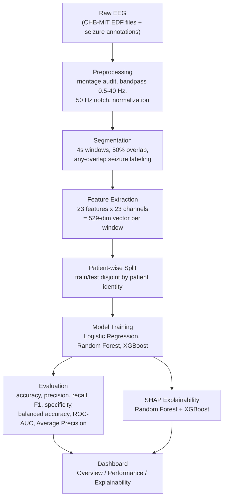

# EEG Seizure Detection 

A patient-wise classical machine learning pipeline for automated seizure detection on non-invasive scalp EEG, with SHAP-based explainability and a Streamlit dashboard for inspecting results.

This project builds and evaluates an automated detector on the CHB-MIT Scalp EEG Database, using handcrafted signal-processing features and classical models chosen specifically because they keep every feature inspectable and every prediction explainable with SHAP, a property raw-waveform deep models do not have.

The central methodological constraint is evaluation honesty: seizures make up roughly 0.35% of the labeled windows in this dataset, and the train/test split is done by patient, not by window. A window-random split would let a model learn patient-specific EEG characteristics as a shortcut, inflating test performance without reflecting how the model would perform on a genuinely new patient — which is the only question that matters for a clinical detector. All results in this repository come from a strict patient-wise, patient-disjoint split.

> **Status.** This is a research baseline evaluated on a single pediatric dataset (CHB-MIT). It has not been validated on adult populations, other EEG hardware, or in a clinical setting, and should be read accordingly.

---

## Table of Contents

- [Features](#features)
- [Dataset](#dataset)
- [Pipeline](#pipeline)
- [Results](#results)
- [Explainability](#explainability)
- [Dashboard](#dashboard)
- [Repository Structure](#repository-structure)
- [Installation](#installation)
- [Running the Pipeline](#running-the-pipeline)
- [Launching the Dashboard](#launching-the-dashboard)
- [Future Work](#future-work)

---

## Features

- **Montage-audited EDF loading** — every recording's channel montage is checked against a canonical 23-channel bipolar layout before use; recordings that use an incompatible montage are excluded, with the reason logged rather than silently dropped or forced into an invalid channel mapping.
- **Preprocessing** — bandpass filtering (0.5–40 Hz), 50 Hz notch filtering, and per-channel amplitude normalization.
- **Segmentation** — fixed 4-second windows with 50% overlap, labeled positive if they overlap any clinician-annotated seizure interval.
- **Handcrafted feature extraction** — 23 time- and frequency-domain features per channel (11 time-domain: mean, standard deviation, RMS, variance, skewness, kurtosis, zero crossings, line length, and the three Hjorth parameters; 12 frequency-domain: five band powers, five relative band powers, spectral entropy, and dominant frequency) across the 23-channel montage, yielding a 529-dimension feature vector per window.
- **Patient-wise evaluation** — train/test splitting by patient identity, so no patient's data appears in both sets.
- **Three classical models** — Logistic Regression, Random Forest, and XGBoost, each with imbalance-aware training appropriate to its own algorithm.
- **Standardized evaluation** — accuracy, precision, recall, F1, specificity, balanced accuracy, ROC-AUC, and Average Precision computed identically for every model, alongside confusion matrices, ROC curves, and Precision-Recall curves.
- **SHAP explainability** — global (mean absolute SHAP) and local (per-prediction) attribution for Random Forest and XGBoost.
- **Streamlit dashboard** — a read-only view over pipeline outputs, with Overview, Performance, and Explainability pages.

---

## Dataset

This pipeline is built for the [CHB-MIT Scalp EEG Database](https://physionet.org/content/chbmit/1.0.0/), a public collection of long-term scalp EEG recordings from pediatric patients with intractable seizures, distributed via PhysioNet. Recordings are sampled predominantly at 256 Hz with 16-bit ADC resolution, and clinician-marked seizure onset/offset times are provided per recording.

The dataset this pipeline was analyzed and trained against contains **24 patients**, **686 EDF recordings**, and **198 annotated seizures** (`reports/dataset_analysis/dataset_summary.json`) — this includes patient chb24, an addition to the original release. Not every recording shares the same channel montage: a pre-pipeline analysis step (`src/dataset_analysis.py`) established that the 23-channel bipolar montage used throughout this pipeline is the largest montage shared consistently across recordings, and a per-recording audit (`src/data_loader.py`) excludes any recording that does not match it, logging the reason to `reports/montage_audit/`.

**Why patient-wise evaluation:** overlapping windows from the same recording are highly correlated, and even non-overlapping windows from the same patient share patient-specific characteristics (baseline rhythm, electrode placement, skull/scalp conductivity) that a model can learn as a shortcut for identifying the patient rather than detecting a seizure. Splitting by patient identity — so a patient's recordings appear entirely in either the training set or the test set, never both — is what makes the reported metrics an estimate of generalization to an unseen patient rather than an inflated, non-generalizing number.

---

## Pipeline



- **Preprocessing** rejects recordings with an incompatible montage before any signal processing happens, then filters and normalizes what remains.
- **Segmentation** converts each accepted recording into a sequence of fixed-length, labeled windows — the unit every downstream model and metric operates on.
- **Feature extraction** reduces each window from raw multichannel time series to a fixed-size numeric vector, independently verified against the underlying per-channel formulas.
- **Patient-wise split** is what makes the following stage's metrics trustworthy as an estimate of new-patient performance.
- **Model training** fits three models with different, algorithm-appropriate approaches to the same class imbalance.
- **Evaluation** applies one standardized metric schema and one set of plots to every model, so results are directly comparable.
- **SHAP explainability** attributes each model's predictions back to individual features, for the two tree-based models.
- **Dashboard** reads and displays all of the above without recomputing anything.

---

## Results

At the default (0.5) decision threshold, on a held-out, patient-disjoint test split (249,719 non-seizure / 875 seizure windows, 0.35% seizure prevalence):

| Model | Accuracy | Precision | Recall | F1 | Specificity | Balanced Accuracy | ROC-AUC |
|---|---:|---:|---:|---:|---:|---:|---:|
| Logistic Regression | 0.8875 | 0.0229 | 0.7474 | 0.0443 | 0.8880 | 0.8177 | 0.874 |
| Random Forest | 0.9969 | 0.8387 | 0.1486 | 0.2524 | 0.9999 | 0.5742 | 0.911 |
| XGBoost | 0.9945 | 0.3370 | 0.6011 | 0.4319 | 0.9959 | 0.7985 | 0.921 |

*Balanced accuracy is derived as (recall + specificity) / 2. Average Precision is part of the standardized evaluation schema (`src/evaluate.py`) but is not included above pending a completed run with saved artifacts.*

These numbers should not be compared at face value: at 0.35% seizure prevalence, accuracy and ROC-AUC alone are both misleading. A classifier predicting "non-seizure" for every window would score 99.65% accuracy — within half a point of Random Forest's 99.69%, despite Random Forest having genuinely useful discriminative ability.

**Logistic Regression's high recall (0.747) comes with a precision cost that makes it unusable as-is.** Its `class_weight="balanced"` training shifts the linear decision boundary to catch more seizures, but a linear model cannot separate 0.35%-prevalence seizure activity from the majority class without flooding predictions with false positives — 97.7% of its positive predictions here are false alarms.

**Random Forest's high specificity (0.9999) reflects an ensemble that rarely votes "seizure" unless very confident**, which is precise (83.9% of its positive predictions are correct) but catches only 14.9% of actual seizures at the default threshold. Its ranking ability is still reasonable (ROC-AUC 0.911); the default 0.5 cutoff is simply a conservative operating point for this class distribution.

**XGBoost is the best-performing model at default threshold**, with the highest ROC-AUC (0.921) and the best F1 (0.432) of the three — a more balanced tradeoff between the recall Logistic Regression achieves and the specificity Random Forest achieves, without either model's respective failure mode.

None of these numbers should be read as a clinical performance claim: they describe window-level classification on one pediatric dataset, not event-level detection latency, false-alarm rate in continuous deployment, or performance on any other population.

---

## Explainability

[SHAP](https://github.com/shap/shap) (SHapley Additive exPlanations) attributes each prediction to the individual features that pushed it toward "seizure" or "non-seizure," and by how much. This pipeline computes SHAP values for Random Forest and XGBoost, both globally (mean absolute SHAP value per feature, across all predictions) and locally (per single prediction).

The **summary plot** shows, for each top feature, how its value (color) relates to its effect on the prediction (horizontal position) across the whole test set. The **bar plot** shows the same features ranked by mean absolute SHAP value — how much each feature matters on average, without direction.

Random Forest's top globally-important features are theta- and alpha-band power at left temporal, posterior-temporal, and occipital channels (T7, P7, O1) — a pattern consistent with established ictal EEG signatures such as rhythmic slowing and elevated amplitude. XGBoost's top feature is gamma-band power at a fronto-central channel pair (F4-C4), a different spatial-frequency profile from Random Forest's despite similar overall ROC-AUC; gamma-band activity at fronto-central electrodes is also the range most susceptible to muscle-artifact contamination, which has not been ruled out as a contributing factor. These SHAP results describe what each model relies on to make its predictions — they are not a clinical or diagnostic interpretation of EEG activity.

---

## Dashboard

A read-only Streamlit dashboard visualizes pipeline outputs from `results/` and `reports/`. It never re-runs feature extraction, training, evaluation, or SHAP computation.

- **Overview** — dataset summary (window counts, seizure prevalence, feature count), a pipeline diagram, and the best model by F1 score.
- **Performance** — the full model comparison table with the best value per metric highlighted, plus ROC and Precision-Recall curves for every model.
- **Explainability** — SHAP summary and bar plots for a selected model (Random Forest or XGBoost).

Pages degrade gracefully: any page whose underlying artifact hasn't been generated yet shows a message pointing to the pipeline step that produces it, rather than failing.

---

## Repository Structure

```text
eeg-seizure-detection/
├── main.py                        # Pipeline entry point / orchestration
├── config.py                      # Frozen dataclass configuration (single source of truth)
├── requirements.txt
├── README.md
│
├── src/
│   ├── data_loader.py              # EDF/annotation loading + per-recording montage audit
│   ├── preprocessing.py            # Filtering, channel selection, normalization
│   ├── segmentation.py             # Windowing and window-level seizure labeling
│   ├── feature_extraction.py       # Time- and frequency-domain feature computation
│   ├── train.py                    # Model construction and patient-wise split
│   ├── evaluate.py                 # Standardized metrics, ROC/PR curves, confusion matrices
│   ├── explain.py                  # SHAP explainability (global + local)
│   ├── dataset_analysis.py         # Pre-pipeline dataset characterization
│   └── utils.py                    # Logging, I/O, and serialization helpers
│
├── dashboard/
│   ├── app.py                      # Streamlit entry point (Overview / Performance / Explainability)
│   ├── data_access.py              # Read-only access to results/ and reports/ artifacts
│   ├── components.py               # Shared UI components (metric cards, comparison table, pipeline diagram)
│   └── styles.py                   # Dashboard theming
│
├── reports/
│   ├── dataset_analysis/           # Dataset characterization report (channels, durations, class balance)
│   └── montage_audit/              # Per-recording montage classification and exclusion log
│
└── results/                        # Produced by running the pipeline (not checked in)
    ├── metrics/                    # Per-model JSON metrics + comparison table
    └── plots/                      # Confusion matrices, ROC/PR curves, SHAP plots
```

---

## Installation

Requires Python 3.10+.

```bash
git clone https://github.com/rohnns/eeg-seizure-detection.git
cd eeg-seizure-detection

python -m venv .venv
source .venv/bin/activate      # Windows: .venv\Scripts\activate

pip install -r requirements.txt
```

Core dependencies: `mne` (EDF I/O and signal processing), `numpy`, `pandas`, `scipy`, `scikit-learn`, `xgboost`, `shap`, `matplotlib`, `seaborn`, `streamlit`.

---

## Running the Pipeline

Download the [CHB-MIT Scalp EEG Database](https://physionet.org/content/chbmit/1.0.0/) separately — it is not distributed with this repository — and place it under `data/raw/chbmit/`:

```text
data/raw/chbmit/
  chb01/
    chb01_01.edf
    chb01_02.edf
    ...
    chb01-summary.txt
  chb02/
    ...
```

If your copy lives elsewhere, override `ProjectPaths.raw_data_dir` in `config.py` accordingly.

```bash
python main.py
```

This runs preprocessing, segmentation, feature extraction, model training, evaluation, and SHAP explainability, writing all artifacts under `results/`. The pipeline is idempotent at the recording and model level: it skips any recording whose feature shard already exists and any model whose saved artifact already exists, so an interrupted run resumes rather than recomputes from scratch.

---

## Launching the Dashboard

Once `results/` has been populated by at least one pipeline run:

```bash
streamlit run dashboard/app.py
```

---

## Future Work

- **Additional datasets** — validate on adult and non-CHB-MIT-hardware EEG to test generalization beyond this pediatric, single-hardware dataset.
- **Improved feature engineering** — the current feature set is univariate per channel; cross-channel connectivity or synchronization features are a natural extension, since seizures are characterized in part by inter-regional synchronization no current feature captures.
- **Deep learning comparison** — evaluate end-to-end/raw-waveform models against this handcrafted-feature baseline under the same patient-wise evaluation protocol.
- **Real-time deployment** — event-level (not just window-level) detection latency and false-alarm rate under continuous operation, with appropriate alert debouncing.
- **External validation** — assess performance on an independent EEG dataset or recording site to test whether current results generalize beyond CHB-MIT.

---

## License and Data Terms

The CHB-MIT Scalp EEG Database is distributed by PhysioNet under the Open Data Commons Attribution License v1.0. Any use of this pipeline's outputs should cite the original dataset:

> Shoeb, A. (2009). *Application of Machine Learning to Epileptic Seizure Onset Detection and Treatment.* PhD thesis, Massachusetts Institute of Technology.
> Goldberger, A., et al. (2000). *PhysioBank, PhysioToolkit, and PhysioNet.* Circulation 101(23):e215–e220.
